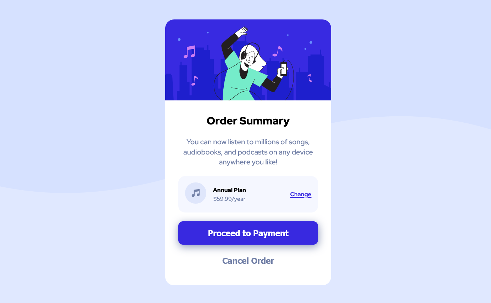
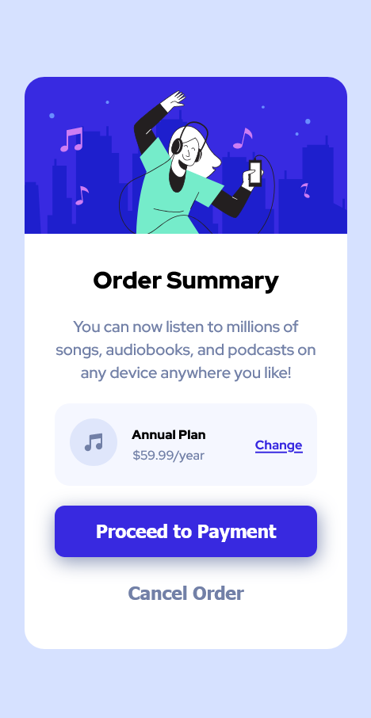

# Frontend Mentor - Order summary card solution

This is a solution to the [Order summary card challenge on Frontend Mentor](https://www.frontendmentor.io/challenges/order-summary-component-QlPmajDUj). Frontend Mentor challenges help you improve your coding skills by building realistic projects. 

## Table of contents

- [Overview](#overview)
  - [Screenshot](#screenshot)
- [My process](#my-process)
  - [Continued development](#continued-development)
- [Author](#author)
- [Acknowledgments](#acknowledgments)

## Overview

### Screenshot

### Continued development

- Flexbox - Flexbox is currently one of my greatest challenge as of late and I am hoping to get directions on where to learn more on this and develop.

- Semantic and Assibility HTML Markup - Obviously a very great challenge i hope to overcome.

- CSS Frameworks - Last but not the least i look forward to making use of *CSS frameworks* in my code even though i'm looking forward on improving greatly in my CSS skills before making use of frameworks.

## Author

- Twitter - [@iamwizzbrown](https://www.twitter.com/iamwizzbrown)

## Acknowledgments

Special credits goes to  for their coaching over the past few months.
They have really been instrumental to my **CODING** growth.
